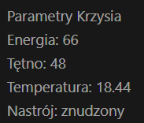
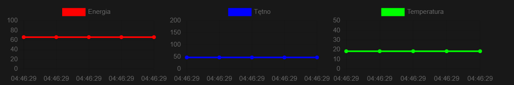

# Zadanie 3 - Aplikacja Kontroli Misji

# Jak uruchomić projekt
W celu pełnego działania aplikacji należy uruchomić:
* backend - https://github.com/micgrz284250/krzysApp-backend
* frontend - https://github.com/micgrz284250/krzysApp-frontend

# Uruchomienie backendu
W przypadku otworzenia backendu w IntelliJ lub VSCode program powinien automatycznie uruchomić projekt po otworzeniu pliku

``
src/main/java/micgrz/krzysbackend/KrzysBackendApplication.java``

W innym przypadku program można uruchomić z konsoli:

``
.\gradlew bootrun
``
# Uruchomienie frontendu

Tak samo jak w przypadku backendu otwarcie programu w IntelliJ lub VSCode powinno pozwolić automatycznie uruchomić projekt

alternatywnie

``
npm install
``

``
npm run dev
``

## Dodatkowe uwagi

Domyślnym portem dla backendu jest http://localhost:8080 (domyślny port Spring Boot)

Jeśli z jakiegoś powodu program uruchomi się na innym porcie należy zmienić zmienną ``API_URL`` w pliku:

``
src/App.vue
``

na poprawny adres

Domyślnym portem dla frontendu jest http://localhost:5173 (domyślny port Vite)

Jeśli z jakiegoś powodu program uruchomi się na innym porcie należy zmienić zmienną ``origins`` w pliku:

``
src/main/java/micgrz/krzysbackend/Controller.java
``

na poprawny adres

# Podstawowe zdolności systemu

Aplikacja pozwala nam śledzić parametry życiowe kosmity Krzysia

Wyświetlane parametry odświeżają się co 5 sekund i pokazywane sa w formie prostej tabelki

Dodatkowo aplikacja pokazuje wykres liniowy dla każdego parametru z 5 ostatnich odczytów

Ostatnią funkcją jest możliwość wysłania wiadomości do naszego kosmity

## Baza danych

Aplikacja korzysta z bazy danych która przechowuje wszystkie wiadomości przesłane do Krzysia oraz historię wszystkich odczytanych parametrów
W celu otwarcia bazy danych należy wejść pod adres

http://localhost:8080/h2-console

i zalogować się:
* login: sa
* haslo: 

link do bazy jest też dostępny w aplikacji

#Wykorzystane technologie

* Spring Boot
* Gradle
* Vite
* Vue 3
* H2

Autor:
Michał Grzebielec